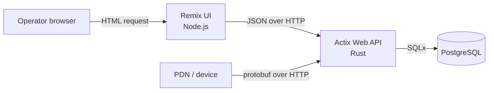
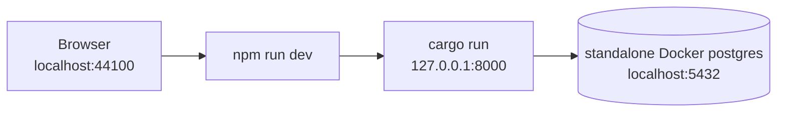
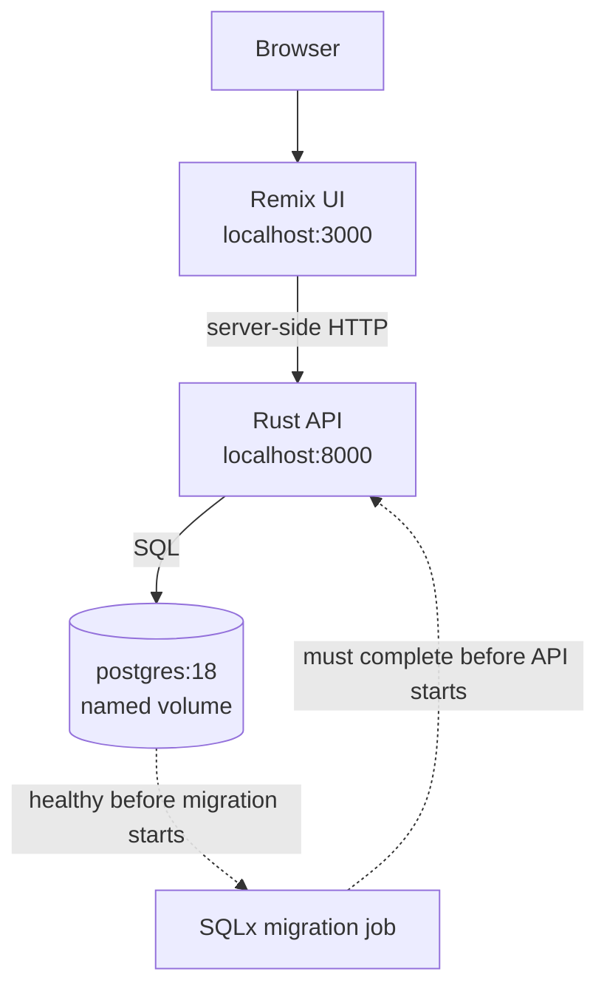
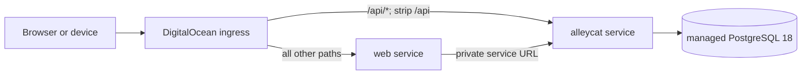

# Architecture

## Overview

Alleycat has three long-running components:

1. A Node/Remix server renders the operator-facing HTML.
2. A Rust/Actix Web server owns the HTTP API and application rules.
3. PostgreSQL stores players, allocated PDN codes, player roles, and device
   crash logs.

The UI is a server-side API client. A browser talks to the UI server; the UI
server fetches JSON from the Rust API and renders HTML. Devices bypass the UI
and send Protocol Buffer messages directly to the Rust API.

The browser is unaware of the API server. It talks to remix and remix gets data from the API.

## Runtime request flows

### Web UI

1. The browser requests the page from the Remix server.
2. Remix selects the route and controller in `web/app/`.
3. The controller's data function calls the Rust API using the request-scoped
   `API_ORIGIN` value.
4. The data function validates the API response with a runtime schema.
5. Remix renders the page to HTML and returns it to the browser.

If the API is unavailable or its response no longer matches the UI schema, the
UI responds with `502` rather than rendering unvalidated data.

### Device log ingestion

For a crash report:

1. A device serializes `alleycat.device.WriteDeviceLogRequest` from
   `proto/device_api.proto`.
2. It posts the bytes to `/device-logs` with
   `Content-Type: application/protobuf`.
3. Actix decodes and validates the message.
4. SQLx inserts the report. The pair `(device_mac, crash_number)` is unique, so
   retrying the same report is safe and does not add another row.
5. The API returns `204 No Content`, including when that report already exists.

See [Device API](device-api.md) for the external contract.

## Deployment topologies

### Native development

The API and UI run as host processes. PostgreSQL runs in a standalone Docker
container literally named `postgres` and publishes port `5432` to the host.

Use this topology for quick source changes and tests. See the
[native development workflow](development.md#native-development).

### Production-like local Compose

All three services run in containers. A one-shot `migrate` container waits for
PostgreSQL, applies migrations, and must finish successfully before the API
starts. The UI calls the API over the private Compose network.

Compose does not publish PostgreSQL to the host. This database is separate from
the standalone `postgres` container used by native development.

### Shared DigitalOcean environment

`spec.yaml` describes two App Platform services and one managed PostgreSQL
database. The `/api/*` route is  to the Rust service and everything else
to the UI. The `/api` match prefix is stripped before the request reaches
Actix, so public `/api/device-logs` becomes internal `/device-logs`.

Both services deploy source from `main`. App spec changes must be applied
explicitly, and database migrations are manual because the spec has no
migration job. See [Operations and deployment](operations.md).

## Code map

### Rust API

| Path | Role |
| --- | --- |
| [`src/main.rs`](../src/main.rs) | Initializes tracing, loads configuration, builds the app, and waits for shutdown |
| [`src/startup.rs`](../src/startup.rs) | Opens the listener, creates the lazy database pool, registers middleware and routes |
| [`src/configuration.rs`](../src/configuration.rs) | Merges YAML and `APP_*` environment settings and builds PostgreSQL connection options |
| [`src/routes/`](../src/routes/) | HTTP transport, validation at the route boundary, and SQL calls for each feature |
| [`src/domain/`](../src/domain/) | Reusable domain types and validation, currently centered on players |
| [`src/proto.rs`](../src/proto.rs) | Includes Rust types generated at build time from the device protocol |
| [`src/telemetry.rs`](../src/telemetry.rs) | Structured Bunyan-compatible tracing output and `RUST_LOG` filtering |
| [`tests/api/`](../tests/api/) | Starts the real server on a random port and exercises it against a migrated temporary database |
| [`build.rs`](../build.rs) | Generates Rust types from `proto/device_api.proto` with vendored `protoc` |
| `.sqlx/` | Checked query metadata used by offline release and lint builds |

The application builds its PostgreSQL pool lazily. Starting the process does
not prove that the database is reachable. Likewise, `/health_check` is a
liveness endpoint only: it returns `200` without querying PostgreSQL.

### Web UI

| Path | Role |
| --- | --- |
| [`web/server.ts`](../web/server.ts) | Node HTTP server, shutdown handling, and default port |
| [`web/app/routes.ts`](../web/app/routes.ts) | Named URL contract for the UI |
| [`web/app/router.ts`](../web/app/router.ts) | Global middleware and controller registration |
| `web/app/actions/*/controller.tsx` | Request handling and error-to-response behavior |
| `web/app/actions/*/data.ts` | Rust API calls plus runtime response validation |
| `web/app/actions/*/show-page.tsx` | Route-specific server-rendered UI |
| [`web/app/middleware/api-origin.ts`](../web/app/middleware/api-origin.ts) | Validates and supplies the server-side API origin |
| [`web/app/ui/`](../web/app/ui/) | Shared document and page UI |

## HTTP surface

The Rust server registers these routes without an internal `/api` prefix:

| Method and path | Consumer | Request | Successful response |
| --- | --- | --- | --- |
| `GET /health_check` | Health checks | None | `200`, empty body |
| `GET /players` | Web UI/operator tools | Optional `page`, `per_page` query | Paginated JSON |
| `POST /players` | Operator tools | URL-encoded form with `name` and optional `email` | `200`, empty body |
| `GET /device-logs` | Web UI/operator tools | Optional `page`, `per_page` query | Paginated JSON |
| `POST /device-logs` | Devices | `application/protobuf` body | `204`, empty body |

For both list routes, `page` defaults to `1` and is forced to at least `1`.
`per_page` defaults to `20` and is clamped to `1..=100`. There is currently no
authentication or API version namespace. Do not treat the historical routes in
`docs/api-contract.md` as implemented endpoints.

In DigitalOcean, prepend `/api` to reach the Rust service from the public
origin. For example, public `/api/health_check` maps to internal
`/health_check`.

## Configuration model

The API loads configuration in this order; later sources override earlier
ones:

1. `configuration/base.yaml`
2. `configuration/local.yaml` or `configuration/production.yaml`, selected by
   `APP_ENVIRONMENT` (`local` by default)
3. Environment variables beginning with `APP_`

Double underscores address nested keys. For example,
`APP_DATABASE__HOST=postgres` overrides `database.host`.

| Setting | Native default | Compose | DigitalOcean |
| --- | --- | --- | --- |
| Environment | `local` | `production` | `production` from the API image |
| API bind | `127.0.0.1:8000` | `0.0.0.0:8000` | `0.0.0.0:8000` |
| Database host | `localhost:5432` | `postgres:5432` | Managed DB binding |
| Database TLS | Not required (`Prefer`) | Not required (`Prefer`) | Required by production config |

The UI has only two runtime settings:

- `PORT`, which defaults to `44100` for a native process and is set to `3000`
  in container environments.
- `API_ORIGIN`, which defaults to `http://localhost:8000`, is
  `http://app:8000` in Compose, and uses the API component's private URL in
  DigitalOcean. It must contain only an HTTP(S) scheme, host, and optional port.

`RUST_LOG` controls API log filtering. The default is `info`.

## Data model

Migrations are append-only, ordered SQL files in `migrations/`.

| Object | Purpose |
| --- | --- |
| `available_pdn_codes` | Pool of unallocated four-digit device codes, excluding reserved values |
| `players` | Player identity, unique PDN code, display name, optional email, mode, and creation time |
| `player_roles` | Zero or more staff/courier/miniboss roles attached to a player |
| `device_logs` | Device crash/reset reports, deduplicated by device MAC plus crash number |
| `player_mode` | PostgreSQL enum: `unassigned`, `hunter`, or `bounty` |
| `player_role` | PostgreSQL enum: `staff`, `courier`, or `miniboss` |

Registration locks and randomly consumes one row from `available_pdn_codes`.
The current database constraint makes player names unique using PostgreSQL's
normal text equality; it does not implement the case-insensitive behavior
described in the legacy porting stories.

For the user-facing meaning of the fields visible today, see the
[operator glossary](operator-guide.md#field-glossary).

Tests create databases named `alleycat_test_<uuid>`. They are intentionally
isolated, but are not dropped automatically after a test run.

Use [Where to make a change](development.md#where-to-make-a-change) to move
from this map to implementation and verification.

## Architectural boundaries

- PostgreSQL is the only durable state.
- The web process is stateless and performs server-side rendering.
- The API is stateless apart from its database connections.
- The public API has no authentication, authorization, rate limiting, or
  explicit versioning.
- DigitalOcean migrations are not automated by `spec.yaml`.

Operational risks and follow-up work are tracked in
[Operations and deployment](operations.md#shared-environment-safety).
