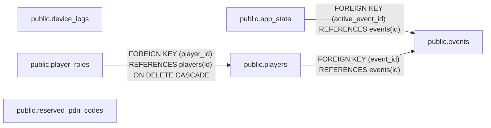

# Database schema

Generated from the repository’s migrations. After changing migrations, run `cargo xtask docs db` with Docker running, then commit the updated documentation. Do not edit this file manually.

[View the complete SQL schema](schema.sql).

## Relationships

Arrows point from the referencing table to the referenced table. Labels show foreign key definitions; cardinality is not inferred.

## Enum types

| Type | Values |
| --- | --- |
| public.player_mode | unassigned, hunter, bounty |
| public.player_role | staff, courier, miniboss |

## public.app_state

| Column | Type | Nullable | Default | Description |
| --- | --- | --- | --- | --- |
| id | integer | no |  |  |
| active_event_id | uuid | yes |  |  |

### Constraints

| Name | Definition |
| --- | --- |
| app_state_active_event_id_fkey | FOREIGN KEY (active_event_id) REFERENCES events(id) |
| app_state_id_check | CHECK ((id = 1)) |
| app_state_id_not_null | NOT NULL id |
| app_state_pkey | PRIMARY KEY (id) |

### Indexes

| Definition |
| --- |
| CREATE UNIQUE INDEX app_state_pkey ON public.app_state USING btree (id) |

## public.device_logs

| Column | Type | Nullable | Default | Description |
| --- | --- | --- | --- | --- |
| id | uuid | no | gen_random_uuid() |  |
| device_mac | macaddr | no |  |  |
| crash_number | bigint | no |  |  |
| uptime_ms | bigint | no |  |  |
| received_at | timestamp with time zone | no | now() |  |
| software_version | text | yes |  |  |
| reset_reason | integer | no |  |  |
| program_counter | bigint | yes |  |  |
| exception_cause | bigint | yes |  |  |
| task_name | text | yes |  |  |

### Constraints

| Name | Definition |
| --- | --- |
| device_logs_crash_number_check | CHECK ((crash_number &gt;= 0)) |
| device_logs_crash_number_not_null | NOT NULL crash_number |
| device_logs_device_mac_crash_number_key | UNIQUE (device_mac, crash_number) |
| device_logs_device_mac_not_null | NOT NULL device_mac |
| device_logs_exception_cause_check | CHECK (((exception_cause &gt;= 0) AND (exception_cause &lt;= '4294967295'::bigint))) |
| device_logs_id_not_null | NOT NULL id |
| device_logs_pkey | PRIMARY KEY (id) |
| device_logs_program_counter_check | CHECK (((program_counter &gt;= 0) AND (program_counter &lt;= '4294967295'::bigint))) |
| device_logs_received_at_not_null | NOT NULL received_at |
| device_logs_reset_reason_check | CHECK ((reset_reason &gt;= 0)) |
| device_logs_reset_reason_not_null | NOT NULL reset_reason |
| device_logs_uptime_ms_check | CHECK ((uptime_ms &gt;= 0)) |
| device_logs_uptime_ms_not_null | NOT NULL uptime_ms |

### Indexes

| Definition |
| --- |
| CREATE UNIQUE INDEX device_logs_device_mac_crash_number_key ON public.device_logs USING btree (device_mac, crash_number) |
| CREATE UNIQUE INDEX device_logs_pkey ON public.device_logs USING btree (id) |

## public.events

| Column | Type | Nullable | Default | Description |
| --- | --- | --- | --- | --- |
| id | uuid | no |  |  |
| name | text | no |  |  |
| venue_name | text | yes |  |  |
| next_pdn_code | integer | no | 1 |  |
| created_at | timestamp with time zone | no |  |  |

### Constraints

| Name | Definition |
| --- | --- |
| events_created_at_not_null | NOT NULL created_at |
| events_id_not_null | NOT NULL id |
| events_name_not_null | NOT NULL name |
| events_next_pdn_code_check | CHECK (((next_pdn_code &gt;= 1) AND (next_pdn_code &lt;= 10000))) |
| events_next_pdn_code_not_null | NOT NULL next_pdn_code |
| events_pkey | PRIMARY KEY (id) |

### Indexes

| Definition |
| --- |
| CREATE UNIQUE INDEX events_pkey ON public.events USING btree (id) |

## public.player_roles

| Column | Type | Nullable | Default | Description |
| --- | --- | --- | --- | --- |
| player_id | uuid | no |  |  |
| role | player_role | no |  |  |

### Constraints

| Name | Definition |
| --- | --- |
| player_roles_pkey | PRIMARY KEY (player_id, role) |
| player_roles_player_id_fkey | FOREIGN KEY (player_id) REFERENCES players(id) ON DELETE CASCADE |
| player_roles_player_id_not_null | NOT NULL player_id |
| player_roles_role_not_null | NOT NULL role |

### Indexes

| Definition |
| --- |
| CREATE UNIQUE INDEX player_roles_pkey ON public.player_roles USING btree (player_id, role) |

## public.players

| Column | Type | Nullable | Default | Description |
| --- | --- | --- | --- | --- |
| id | uuid | no |  |  |
| pdn_code | text | no |  |  |
| name | text | no |  |  |
| mode | player_mode | no | 'unassigned'::player_mode |  |
| email | text | yes |  |  |
| created_at | timestamp with time zone | no |  |  |
| event_id | uuid | no |  |  |

### Constraints

| Name | Definition |
| --- | --- |
| players_created_at_not_null | NOT NULL created_at |
| players_event_id_fkey | FOREIGN KEY (event_id) REFERENCES events(id) |
| players_event_id_not_null | NOT NULL event_id |
| players_event_name_key | UNIQUE (event_id, name) |
| players_event_pdn_code_key | UNIQUE (event_id, pdn_code) |
| players_id_not_null | NOT NULL id |
| players_mode_not_null | NOT NULL mode |
| players_name_not_null | NOT NULL name |
| players_pdn_code_check | CHECK ((pdn_code ~ '^[0-9]{4}$'::text)) |
| players_pdn_code_not_null | NOT NULL pdn_code |
| players_pkey | PRIMARY KEY (id) |

### Indexes

| Definition |
| --- |
| CREATE INDEX players_event_created_at_id_idx ON public.players USING btree (event_id, created_at DESC, id DESC) |
| CREATE UNIQUE INDEX players_event_name_key ON public.players USING btree (event_id, name) |
| CREATE UNIQUE INDEX players_event_pdn_code_key ON public.players USING btree (event_id, pdn_code) |
| CREATE UNIQUE INDEX players_pkey ON public.players USING btree (id) |

## public.reserved_pdn_codes

| Column | Type | Nullable | Default | Description |
| --- | --- | --- | --- | --- |
| code | text | no |  |  |
| reason | text | yes |  |  |

### Constraints

| Name | Definition |
| --- | --- |
| reserved_pdn_codes_code_check | CHECK ((code ~ '^[0-9]{4}$'::text)) |
| reserved_pdn_codes_code_not_null | NOT NULL code |
| reserved_pdn_codes_pkey | PRIMARY KEY (code) |

### Indexes

| Definition |
| --- |
| CREATE UNIQUE INDEX reserved_pdn_codes_pkey ON public.reserved_pdn_codes USING btree (code) |
